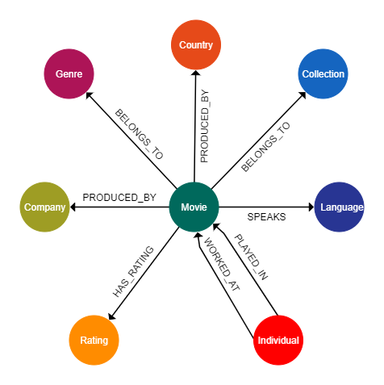

# Neo4j-MovieDB

# Tools Used

- Neo4j 3.5.18
- Spring Boot
- yEd Graph Editor
- IntelliJ IDEA 2020
- Visual Studio Code

# Problematic movie ids

- some lines had NULL bytes
- missing quotes on ```overview``` property:
    - line: 19765-19766, id: 82663 
    - line: 29574-29575, id: 122662 
    - line: 35673-35674, id: 249260

# DB Snapshot using yEd



# Dataset 

- Taken from: https://www.kaggle.com/rounakbanik/the-movies-dataset
- Parsed using ```./Movies/movie-parser.py```
- Above parser produces the respective .csv files used for populating the DB

# Populating DB

- Copy & paste the resulting .csv files from parser, to the neo4j import folder
- Run the cypher commands within the script ```./Populate/populate.txt```

# Executing Queries

Three ways:
- Import collection through Postman. ```./Queries/postman/MoviesDBNeo4j.postman_collection.json``` 
- Use cURL. ```./Queries/cURL/cURL queries.txt```
- Use Cypher. ```./Queries/cypher queries.txt```

# Query Results

- ```./Queries/cURL/results```
- For the best/worst queries **(queries 16, 17)**, I return all the best/worst results not only one.
- Because query 18 is very computation heavy, I constructed an alternative which only compares two movies:
  - Dial M for Murder
  - Psycho

# Sample Images

- ```./Queries/images```
